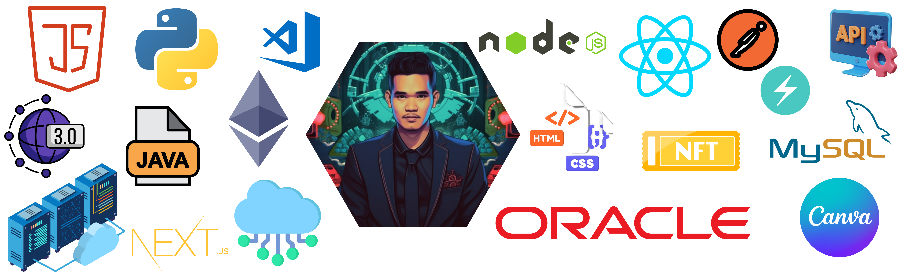

<p align="center">

<a href=""></a>
</p>




<div align="center">
<!--   
   -->
  
</div>

###


###


###

<div align="center">
  <a href="https://www.youtube.com/@ashishnegi2219" target="_blank">
    
  </a>
  <a href="https://www.instagram.com/mr.ashishnegi/" target="_blank">
    
  </a>
  <a href="https://discord.gg/YSf2FPWGbU" target="_blank">
    
  </a>
  <a href="mailto:ashishnegi0511@gmail.com" target="_blank">
    
  </a>
  <a href="https://www.linkedin.com/in/ashishnegiweb3/" target="_blank">
    
  </a>
</div>

<br clear="both">

 ```ruby
 class Primate < Person
   def initialize
     @name = 'Ashish Negi'
     @age = 26
     @work = [ 'Infosys', 'SevenBits', 'BunnyfiedLabs']
     @hobbies = [ 'Swimming', 'Chess', 'Moba Games' ]
   end

   def current_location
     'Mumbai, MH, India'
   end

   def Looking_for_locations
     ['Washington, D.C.', 'Virginia']
   end

   def currently
     {
       studying: [ '3 JS' ],
       workingOn: [ 'GiftBox','Cookie High', 'BattlePugs' ],
      }
   end
 end
 ```

###


###

###
